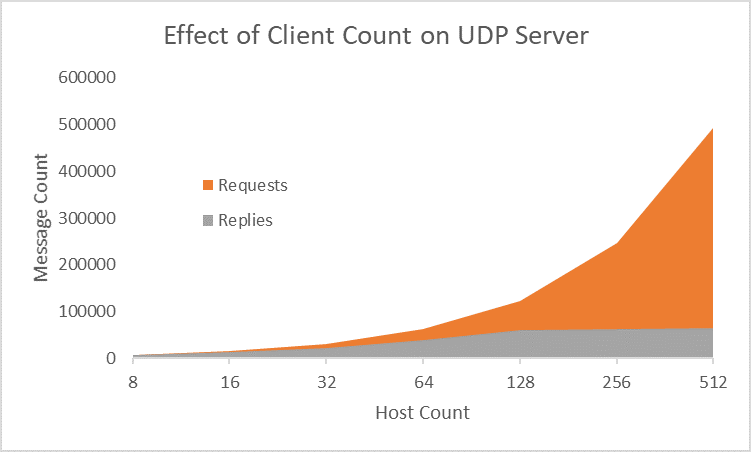

#  DDoS Attack Simulation with Mininet

Wirtten By Drake Lambert

## About

This simulation was set up and tested by a single script, ```dos.py```. The script moves through several rounds of simulated DDoS attacks, doubling the number of attacking hosts each round. A DDoS attack is performed by having a single host attempt to receive a flood of UDP messages being sent repeatedly by all other hosts. Rounds last for 30 seconds. WireShark was used to monitor packet loss and responses from the server.

## Parameters

### Constants

- Link bandwidth of 10 megabits per second
- Link delay of 5 milliseconds
- Packet loss of 5 percent
- Max queue size of 1000 bytes

### Variables

Host counts of 8, 16, 32, 64, 128, 256, and 512 were used to measure results.

## Results



The results shown operated as expected from 8 to 32 hosts. Approximately 5% of traffic was lost. At 64 hosts, however, the server started to reply to far fewer packets. It can be seen that the server reached a wall at approximately 65,000 successful replies over 30 seconds over the last two tests. This is likely due to the low computing resources that the server had and an overflow of the link queue.


After bandwidth is increased to 100 megabits, delay set to 0 milliseconds, packet loss set to 0 percent, and max queue size set to 100,000 bytes, there was some improvement in response.

During all tests, the maximum bandwidth was reached.

## Running the Tests

The source for this document and the three required scripts can be found at https://github.com/DrakeLambert/LSU-Projects/tree/master/Junior/CSC4501.

1. Place the 3 files, ```dos.py```, ```client.py```, and ```server.py``` in the ```custom\``` folder within the root mininet folder.
1. Execute the tests with
    ```bash
    sudo python ./dos.py
    ```