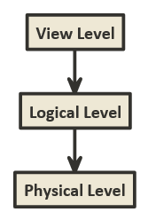

# Homework 1

Drake Lambert

1. Two advantages of database vs file system:
    - DB offers reduced redundancy
        - Information can be linked with foreign keys. In this way you can store data once and link to it from other data.
    - Db offers centralized data control
        - Apps using a file system for data storage usually manage their files separately. A db puts all data into one place. This allows for easier data management and backup.
2. This architecture is used to maintain independence between how data is physically stored, what data is stored, and what data is shown to users.  
    
    - Physical data independence: Physical data storage on disk may be very complicated, but this is hidden from the user at the logical level.
        - Lies between physical and logical level
    - Logical data independence: Applications/users may only need access to particular data in a database. To shield complexity of the logical db and to secure data, views are used to show only what an app/user needs.
        - Lies between view and logical level
3. Definitions
    - Database Management System: software for managing a database
    - Database Administrator: User who administrates all actions in a database. They usually have database root access.
    - Data integrity: ensuring that data is accurate and consistent across attempts to use the data
    - Data inconsistency: When the same data recorded in multiple locations has different values
    - Data abstraction: Shielding complexity from users at multiple levels by showing it in a simplified way
    - Physical Schema: How data is physically stored on the disk
    - Logical Schema: What data is stored in the database.
    - Data model: provides a way to describe the data in a database with ways to describe data and relationships.
    - Data definition language: language used by the database system to specify the database schema 
    - Data dictionary: Part of the physical structure of the database that stores schema information
    - Relational database: A database that stores data in tables where rows may have relations to other rows in other tables.
4. SQL
    1. Retrieval
        ```sql
        Select Snum, Name, Program from CSC4402
        ```
    2. Change
        ```sql
        UPDATE CSC4402 SET Dept = 'CSC' WHERE Snum = 'S4';
        ```
    3. Removal
        ```sql
        DELETE FROM CSC4402 WHERE City = 'Dallas';
        ```
    4. Addition
        ```sql
        INSERT INTO CSC4402 VALUES ('S9', 'Julia', 'CSC', 'M.S.', 'Baton Rouge');
        ```