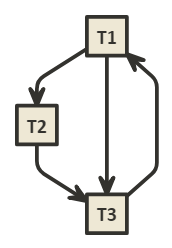
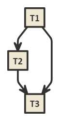
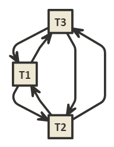

# Homework 6

Drake Lambert

## 1

A. The schedule is serializable because it has no cycles.

B. S': T0 ,T3 ,T2 ,T1 ,T4

## 2

A. A transaction is a logical unit consisting of data reads and/or writes. A(tomicity) means that given a transaction executed on an ACID compliant system, either the whole transaction will succeed or the whole transaction will not be applied.

B1. 

B2. S1 and S2 are conflict equivalent as they have the same precedence graph.

## 3

A. 

B. The schedule is not serializable because it has a cycle.

## 4

A.

| T1'   | T2'   | T3'
| ---   | ---   | ---
| LX(A) | LX(C) | LX(B)
| R(A)  | R(C)  | R(B)
| LX(B) |       |
| R(B)  | W(C)  | W(B)
|       | LX(A) | LX(C)
| W(A)  | R(A)  | R(C)
| W(B)  | W(A)  | W(C)
| LX(D) | LX(D) | UN(B)
| R(D)  | W(D)  | UN(C)
| W(D)  | UN(C) |
| UN(A) | UN(A) |
| UN(B) | UN(D) |
| UN(D) |       |

B.

| T1'   | T2'   | T3'
| ---   | ---   | ---
| LX(A) | LX(C) |
| R(A)  | R(C)  |
| LX(B) |       |
| R(B)  | W(C)  |
|       |       |
| W(A)  |       |
| W(B)  |       |
| LX(D) |       |
| R(D)  |       |
| W(D)  |       |
| UN(A) |       |
| UN(B) | LX(A) |
| UN(D) | R(A)  | LX(B)
|       | W(A)  | R(B)
|       | LX(D) |
|       | W(D)  | W(B)
|       | UN(C) |
|       | UN(A) | LX(C)
|       | UN(D) | R(C)
|       |       | W(C)
|       |       | UN(B)
|       |       | UN(C)

C.

| T1'   | T2'   | T3'
| ---   | ---   | ---
| LX(A) | LX(C) | LX(B)
| R(A)  | R(C)  | R(B)
| LX(B) |       |
| R(B)  | W(C)  | W(B)
|       | LX(A) | LX(C)
| W(A)  | R(A)  | R(C)
| W(B)  | W(A)  | W(C)
| LX(D) | LX(D) | UN(B)
| R(D)  | W(D)  | UN(C)
| W(D)  | UN(C) |
| UN(A) | UN(A) |
| UN(B) | UN(D) |
| UN(D) |       |

