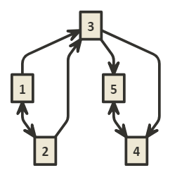
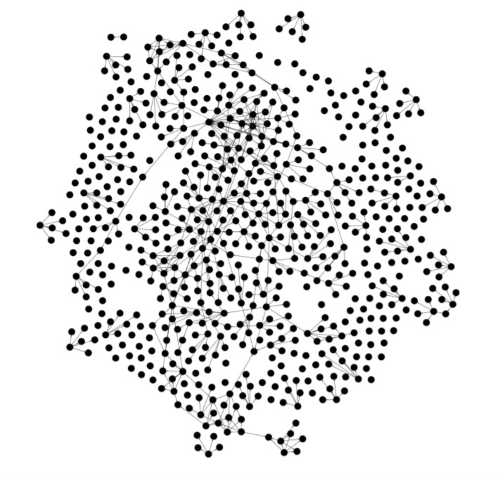

# Homework 4

Drake Lambert

## 1

A. We construct an inverted index for the terms in the documents by listing the documents that contain a given term for every term in every document. If you query "new times", you will get back all three documents as each document contains at least one of the searched terms.

B. When using the vector space model to search for "new times", the results are ordered C1, C3, C2 using the following calculations.

Query = "new times"

||||||||||||
|---|---|---|---|---|---|---|---|---|---|---|
|C1|TF_c1|WF_c1|DF|IDF|TF-IDF_c1|TF_q|WF_q|TF-IDF_q|SCORE|0.062016263
|new|1|1|2|0.176091259|0.176091259|1|1|0.176091259||
|york|1|1|2|0.176091259|0.176091259|0|0|0||
|times|1|1|2|0.176091259|0.176091259|1|1|0.176091259||
|||||||||||
|C2|TF_c2|WF_c2|DF|IDF|TF-IDF_c2|TF_q|WF_q|TF-IDF_q|SCORE|0.031008132
|new|1|1|2|0.176091259|0.176091259|1|1|0.176091259||
|york|1|1|2|0.176091259|0.176091259|0|0|0||
|post|1|1|1|0.477121255|0.477121255|0|0|0||
|||||||||||
|C3|TF_c3|WF_c3|DF|IDF|TF-IDF_c3|TF_q|WF_q|TF-IDF_q|SCORE|0.031008132
|london|1|1|1|0.477121255|0.477121255|0|0|0||
|times|1|1|2|0.176091259|0.176091259|1|1|0.176091259||

C.

| Engine | Precision              | MAP
| ---    | ---                    | ---
| G      | k1=1/1; k2=2/2, k3=2/3 | 8/9
| Y      | k1=1/1; k2=1/2, k3=2/3 | 13/18

## 2

P(USA | 0) = 5/12; P(USA | 1) = 2/11  
P(Boston | 0) = 2/12; P(Boston | 1) = 1/11  
P(Osaka | 0) = 1/12; P(Osaka | 1) = 2/11  
P(Newyork | 0) = 2/12; P(Newyork | 1) = 1/11  
P(Tokyo | 0) = 1/12; P(Tokyo | 1) = 2/11  
P(Japan | 0) = 1/12; P(Japan | 1) = 2/11  

P(0 | d5) = 6.697e-6
P(1 | d5) = 9.031e-6

## 3

A. Page rank equation: `sum(0.7 * ri / di + 0.3 / 5)`

## 4

A.

B.

Average node degree: 0.896  
This is the average amount of connections each node has.

Graph diameter: 6
Of the two nodes with the greatest degree of separation, how many degrees of separation are there.

Average path length: 1.682
Average of all shortest paths between all nodes.

C.

| Movie | Rank
| --- | ---
| 76341 | 1
| 241554 | 2
| 260346 | 3
| 27576 | 4
| 106646 | 5
